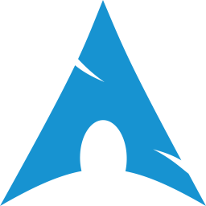
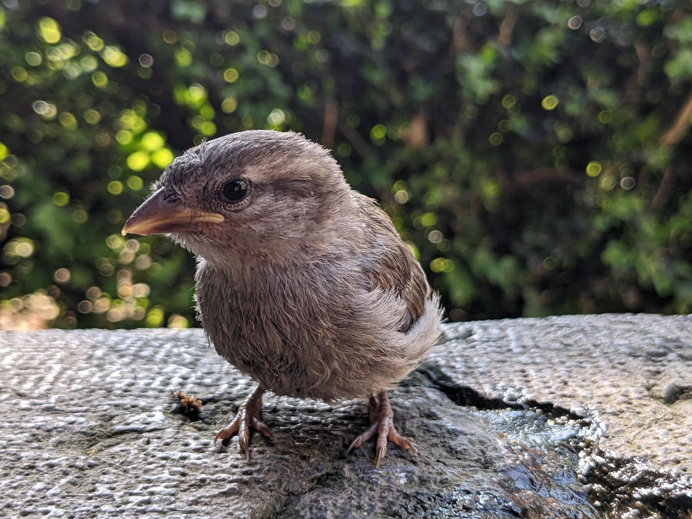
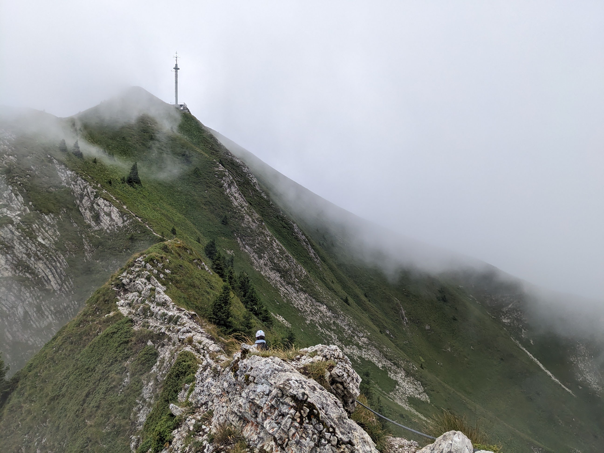
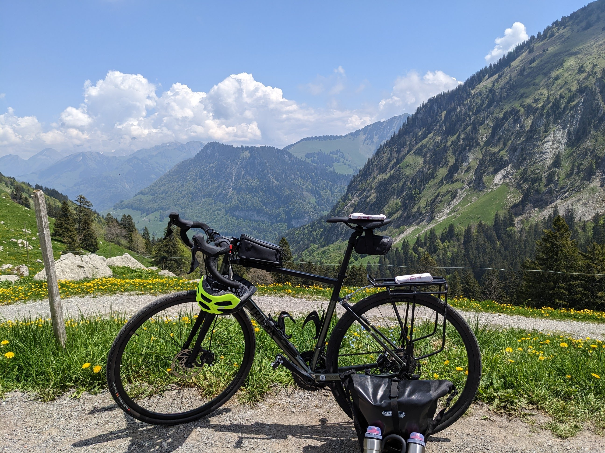
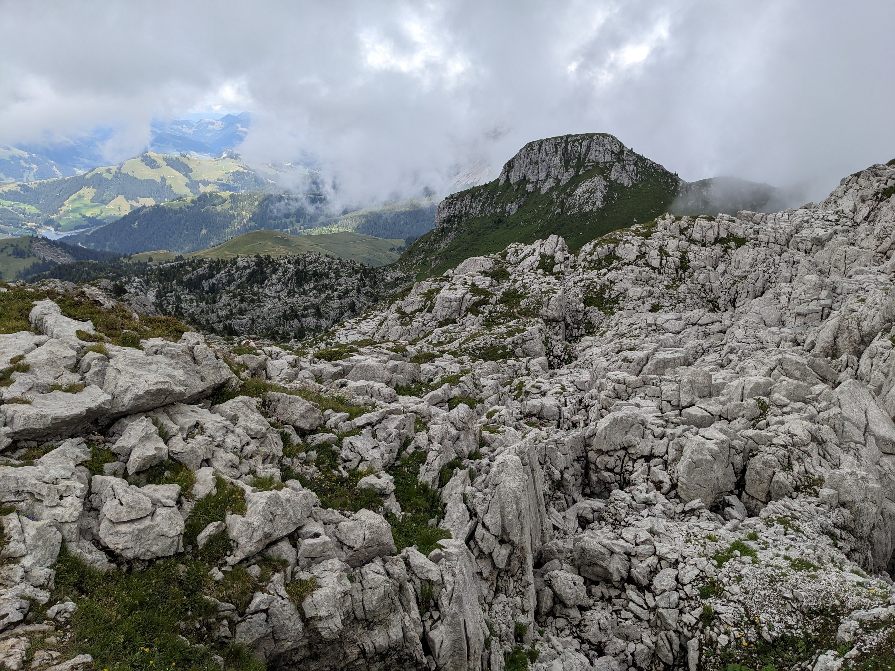
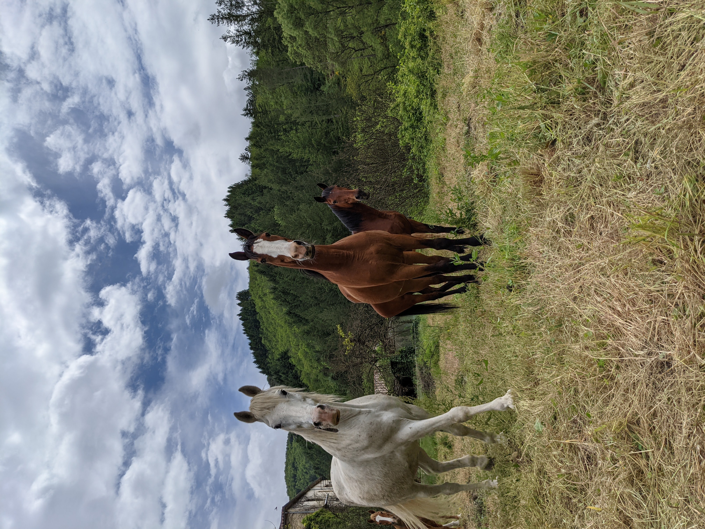
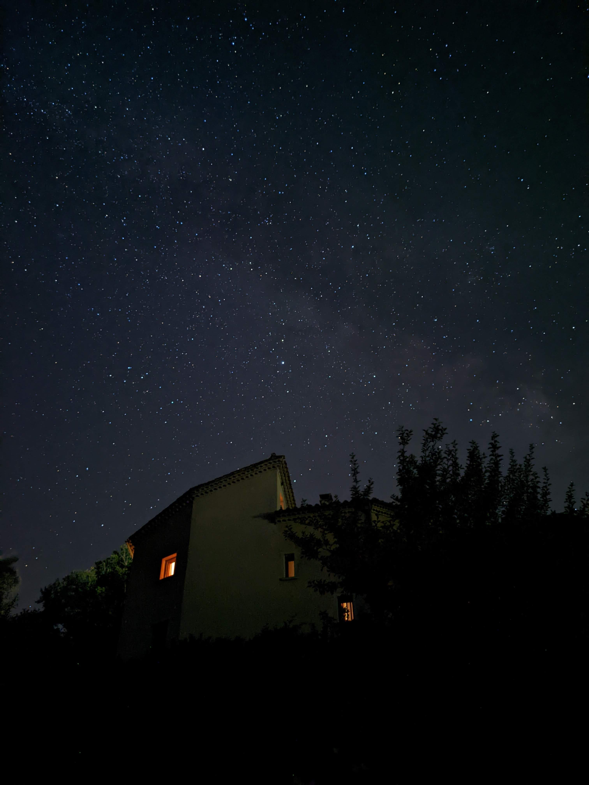

  
  <h1> Hi there 👋</h1>

  
  
  

## 🔍 `whoami` ?

Software engineer at Teads

Functional programming & Scala enthusiast, who lost his way into the frontend world and built up a [draft portfolio](https://iusildra.dev)

Sunny Guard 🦩

## 📚 What do I use ?

<table>
  <tr>
    <th><h3 align="center">Main languages</h3></th>
    <th><h3 align="center">Libraries / frameworks</h3></th>
  </tr>
  <tr align="center">
    <td>
      

        
        
        
      

    </td>
    <td>
      

        
        
      

    </td>
  </tr>
  <tr>
    <th><h3 align="center">Databases</h3></th>
    <th><h3 align="center">Cloud</h3></th>
  </tr>
  <tr align="center">
    <td>
      

        
      

    </td>
    <td>
      

        
      

    </td>
  </tr>
  <tr>
    <th><h3 align="center">Coding environment</h3></th>
    <th><h3 align="center">Others</h3></th>
  </tr>
  <tr align="center">
    <td>
      

        
        
      

    </td>
    <td>
      

        
        
      

    </td>
  </tr>
</table>

## 🧑‍💻 Recent activities

<table>
  <tr>
    <th><h3 align="center">Scala.IO website</h3></th>
    <th><h3 align="center">Scala debugger for VS Code</h3></th>
  </tr>
  <tr height="max-content">
    <td width="50%" align="center">
      
    </td>
    <td width="50%" align="center">
      
    </td>
  </tr>
  <tr>
    <td>
      <ul>
        <li>UI written in <a href="https://www.scala-js.org">Scala.js</a></li>
        <li>Reactive UI with <a href="https://laminar.dev">Laminar</a></li>
        <li>Bits of code generation</li>
      </ul>
    </td>
    <td>
      <ul>
        <li>Created a new evaluation mode</li>
        <li>Worked on hot code reload</li>
        <li>Fixed a few bugs</li>
      </ul>
    </td>
  </tr>
  <tr>
    <th colspan=2><h3 align="center">Scala 3 compiler</h3></th>
  </tr>
  <tr>
    <td colspan=2 align="center">
      
    </td>
  </tr>
  <tr>
    <td colspan=2>
      <ul>
        <li>Progressively landing on the compiler with the <a href="https://compileracademy.carrd.co">scala compiler academy</a></li>
        <li><b>trying</b> to fix some issues</li>
      </ul>
    </td>
  </tr>
</table>

## 📈 Some stats

## 💬 What else ? Hiking :mountain:, biking :bicyclist:, horse riding :horse:, via ferrata :climbing:...

|                                                      |                    |  |
| ------------------------------------------------------------------------- | ------------------------------------------------ | ------------------------------------------ |
|  |  |               |
|                                                  |     |                       |
